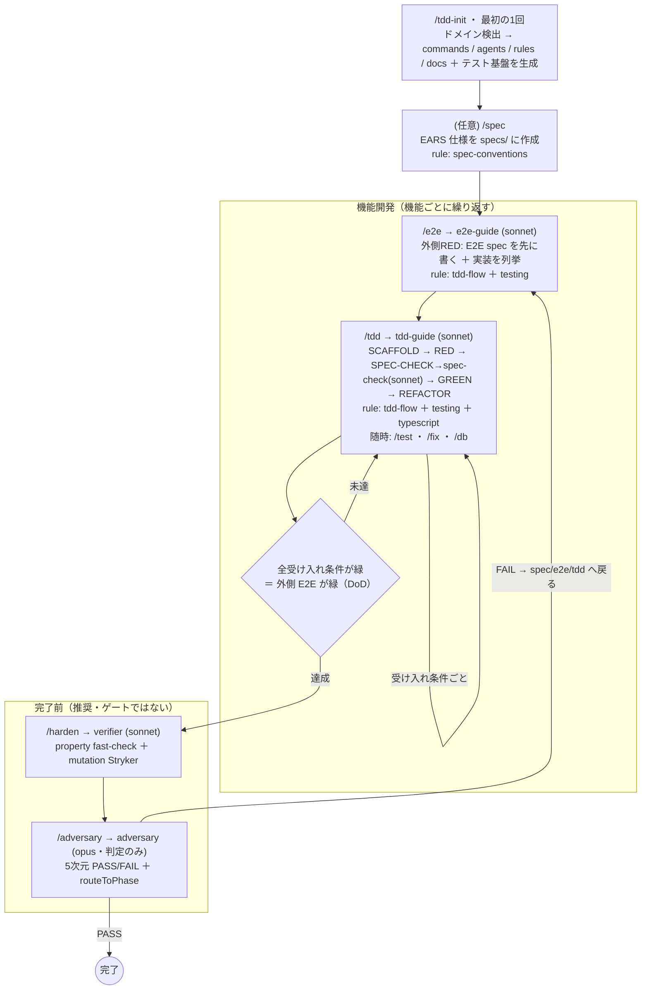

# TDD-training

**1 つの汎用ジェネレータ（`tdd-init`）から、各プロジェクトのドメインに合わせた dual-loop TDD 環境を生成する**ための仕組み。

対象プロジェクトで `/tdd-init` を実行すると、Claude がそのプロジェクトのドメインを読み取り、固有の **slash commands**・**subagents**・**auto-apply rules**・**参照ドキュメント**を `.claude/` 配下に生成し、テスト実行基盤（Vitest / Playwright / テスト DB / 認証 storageState / fast-check / Stryker）が無ければ導入する。スキル本体は汎用のまま、出力物がドメイン特化になる。

```
┌──────────────────────┐  /tdd-init   ┌─────────────────────────────────────────┐
│ 汎用ジェネレータ      │ ───────────> │ プロジェクト固有の commands/agents/rules   │
│ tdd-init (1 つ)       │  ドメインに   │ <project>/.claude/ 配下                    │
│ ※TS/Node/Next.js 前提 │  合わせ生成   │  commands: /e2e /tdd /test /fix /review … │
└──────────────────────┘              │  agents  : tdd-guide / e2e-guide / …      │
                                       │  rules   : tdd-flow / testing / typescript │
                                       └─────────────────────────────────────────┘
        日々の開発:  /e2e <機能> → /tdd <e2e spec パス>
        （任意）     /spec で EARS 仕様 → /harden（VDD）→ /adversary（独立判定）
```

## 設計の核

- **acceptance criteria は実行可能なテスト**（仕様書ではなく E2E / integration test）。仕様書 → テストへの翻訳ステップを取り除き、「仕様の言葉を取りこぼす」失敗を構造的に防ぐ。
- **Dual-loop**: 外側（E2E）を先に書いて RED にし、内側（unit / integration）を 1 受け入れ条件 = 1 サイクルで緑にする。最後に外側の E2E が緑になる = 機能完成。
- **技術スタックは固定**（TypeScript / Node.js、主に Next.js。unit/integration=Vitest、E2E=Playwright）。**ドメインだけを汎用パラメータ**として扱う。
- **統合 / E2E を後回しにしない**: `tdd-init` がテスト DB・認証・storageState・シードまで実行基盤を立てて疎通確認する。基盤が無いと unit に倒れるため、ここをセットアップでやり切る。

## dual-loop を土台にした選択的な拡張（VSDD からの選択導入）

dual-loop TDD を土台に、SDD / VDD / 敵対的レビューの要素を**選択的・加算的**に取り込んでいる。重量級の機構（フェーズ強制・状態機械・トレーサビリティ ID 連鎖）は**持たない**。

| 取り込んだ要素 | 何をするか | 位置づけ |
|----------------|-----------|----------|
| **Adversary レビュー**（`/adversary`） | 会話履歴を共有しない独立コンテキストの `adversary` agent（model: opus）が、強制否定・証拠必須で 5 次元のバイナリ判定（PASS/FAIL）を出し、FAIL なら戻すべきフェーズを指す | **ゲートではない**。`/review`（同一コンテキスト自己点検）と併用する独立した第二の目 |
| **VDD**（`/harden`） | 緑の後に property-based（fast-check）でテストの「広さ」、mutation（Stryker）で「深さ＝殺傷力」を強化。生存ミュータントをテスト追加で潰す | **推奨ステップ**。完了前に通すが必須ゲートではない |
| **EARS 仕様**（`/spec`） | ラフな要望を EARS 形式（`WHEN … THE SYSTEM SHALL …` 等）の構造化仕様に起こし、REQ-ID と推奨テストレベルを付ける | **任意入力**。acceptance の実体は引き続きテスト。spec はその上位権威ではなく思考・コミュニケーションの補助 |

### 持たないもの（dual-loop の軽さを壊さない）

- **フェーズ強制フック**（PreToolUse 等でテスト前のソース編集を機械的にブロックする仕組み）。`/harden`・`/adversary` は推奨であってゲートではない。
- **`.vsdd/` のような状態機械・`state.json`・`history.jsonl` 監査ログ**。
- **Beads 等のトレーサビリティ ID 連鎖**（REQ→PROP→TEST→IMPL→FIND→PROOF）。
- **install.sh / グローバル登録 / CI 設定**などの配布・インフラ。

## 開発フロー（全体像）



- SPEC-CHECK＝仕様↔テスト整合（緑化前・RED 直後）、`/harden`＝テスト自体の強化（緑化後）
- サブエージェントを呼ぶコマンド: `/e2e`（e2e-guide）・`/tdd`（tdd-guide → spec-check）・`/harden`（verifier）・`/adversary`（adversary）・`/impact`（impact-analyzer）。それ以外はメイン文脈で完結。
- 常時効く規律は `tdd-flow.md`。`testing.md`・`typescript.md`・`spec-conventions.md` は対象ファイルを編集した時だけ自動添付。
- `/review` は随時の**同一コンテキスト**セルフ点検（`/adversary`＝独立コンテキストとは別物）。`/spec` は任意・非ゲート。
- テストと仕様の結合キーは `@covers REQ-NNN` タグ（`rules/spec-conventions.md`・`rules/testing.md`）。追加仕様時の変更セット管理・DIFF-CHECK・回帰ゲートの詳細は `rules/tdd-flow.md`（インライン manifest 契約）を参照。

## 追加仕様（incremental）フロー

既存機能への仕様変更は**別フローを作らず、既存ループに差分の前段と 2 ゲートを加算**する。

1. `/spec --delta <変更内容>` — 更新 EARS ＋ 変更セット（追加/変更/削除 REQ-ID）を spec に記録
2. `/impact <変更 REQ 群>` — `impact-analyzer` が影響レポート（追加/変更/削除すべきテスト・影響コード・回帰セット）を返す
3. `/tdd <spec>`（差分スコープ）— SCAFFOLD → RED → **DIFF-CHECK**（変更 REQ ↔ テスト変更 1:1・orphan 検出）→ GREEN → REFACTOR
4. 完了前に **回帰ゲート**（`/impact` の回帰セットを全実行して緑確認）→ `/harden`（影響箇所）→ `/adversary`（新 REQ を満たし旧 REQ を壊していないか）

## 生成されるコマンド

| コマンド | 役割 |
|----------|------|
| `/tdd-init` | （セットアップ）ドメイン検出・基盤導入・上記の生成。最初の 1 回だけ |
| `/spec` | （任意）EARS 形式の構造化仕様を `.claude/tdd/specs/<slug>.md` に起こす。ゲートではない。`--delta` で追加仕様の変更セット（追加/変更/削除 REQ-ID）も記録 |
| `/e2e` | 外側ループ。E2E spec を先に書く（RED）→ 必要な実装を列挙して inner loop の work item にする |
| `/tdd` | 内側ループ。SCAFFOLD → RED → SPEC-CHECK → GREEN → REFACTOR を `tdd-guide` agent に駆動させる |
| `/impact` | 仕様変更の影響範囲を `impact-analyzer` で解析。追加/変更/削除すべきテスト・影響コード・回帰セットを返す |
| `/test` | unit / integration テストの実行＋解析 |
| `/fix` | lint / format / typecheck の自動修正チェーン |
| `/harden` | （推奨）VDD ハードニング。property-based + mutation を `verifier` agent に駆動させる |
| `/review` | 10 観点の**同一コンテキスト**セルフレビュー |
| `/adversary` | **独立コンテキスト**の `adversary` agent によるバイナリ判定（PASS/FAIL + routeToPhase） |
| `/db` | DB 操作（DB がある場合のみ生成） |

## このリポジトリの構成

```
TDD-training/
├── README.md
└── skills/
    └── tdd-init/
        ├── SKILL.md                 # 汎用ジェネレータ本体（/tdd-init）
        └── templates/               # 生成元（{{...}} を検出・ドメイン情報で置換）
            ├── commands/            # → <project>/.claude/commands/*
            │   ├── spec.md          #   /spec   （EARS 仕様・任意。--delta で変更セット記録）
            │   ├── e2e.md           #   /e2e    （外側ループ）
            │   ├── tdd.md           #   /tdd    （内側ループ）
            │   ├── test.md          #   /test
            │   ├── fix.md           #   /fix
            │   ├── harden.md        #   /harden （VDD）
            │   ├── review.md        #   /review （同一コンテキスト）
            │   ├── adversary.md     #   /adversary（独立コンテキスト）
            │   ├── impact.md        #   /impact （影響範囲解析）
            │   └── db.md            #   /db     （DB がある場合）
            ├── agents/              # → <project>/.claude/agents/*
            │   ├── tdd-guide.md     #   内側ループ専任（model: sonnet）
            │   ├── e2e-guide.md     #   外側ループ専任（model: sonnet）
            │   ├── verifier.md      #   VDD ハードニング専任（model: sonnet）
            │   ├── adversary.md     #   独立レビュー専任（model: opus, 判定のみ）
            │   ├── spec-check.md    #   仕様↔テスト整合判定専任（model: sonnet, 判定のみ）
            │   └── impact-analyzer.md  #   影響範囲解析専任（model: sonnet, 解析のみ）
            ├── rules/               # → <project>/.claude/rules/*
            │   ├── tdd-flow.md      #   dual-loop の規律（常時適用）
            │   ├── testing.md       #   テストの書き方・実コード例（property/mutation 含む）
            │   ├── typescript.md    #   TypeScript 規約
            │   └── spec-conventions.md  #   EARS 仕様の規約（`.claude/tdd/specs/**` 編集中に自動添付）
            ├── docs/                # → <project>/.claude/tdd/*
            │   ├── commands.md      #   実コマンド一覧
            │   ├── test-strategy.md #   レベル割当 + property/mutation の適用判断
            │   ├── test-infra.md    #   統合/E2E 実行基盤の構成・起動手順
            │   ├── spec-template.md #   /spec が参照する EARS 雛形
            │   └── progress.md      #   進捗ログ
            └── infra/               # 統合/E2E の実行基盤（検出した DB/認証に適応）
                ├── docker-compose.test.yml   # ブランチ別テスト DB
                ├── integration-setup.ts      # 実 DB 統合の globalSetup（migrate/clean）
                ├── playwright.global-setup.ts # ログイン→storageState 保存
                └── auth-test-helpers.ts       # requireAuth/requireRole モック
```

## 使い方

スキルはグローバル（`~/.claude`）には登録しない。**使いたいプロジェクトにだけ手でコピーする。**

1. **対象プロジェクトにスキルをコピーする。**

   ```sh
   cp -R /path/to/TDD-training/skills/tdd-init <project>/.claude/skills/tdd-init
   ```

2. **対象プロジェクトのルートで `/tdd-init` を実行する。**
   - ドメイン・スタック（pkg manager / Next.js router / 既存 Vitest・Playwright / **DB・認証**）を検出。
   - テスト基盤が無ければ導入（unit=Vitest は自動、E2E=Playwright・テスト DB・VDD ツールは確認の上）。
   - **統合 / E2E の実行基盤**（テスト DB の docker-compose・マイグレーション・認証ログイン→storageState・シード）を用意し、**各レベルが緑になる疎通確認**まで行う。
   - `.claude/commands/`・`.claude/agents/`・`.claude/rules/`・`.claude/tdd/` を生成し、`CLAUDE.md` をドメイン情報入りで書き起こす。

3. **日々の開発は `/e2e` → `/tdd`。**
   - `/e2e <作りたい機能のラフな説明>` で外側ループの E2E spec を書く（RED）→ 必要な実装を列挙。
   - `/tdd <e2e spec パス>` で内側ループ（SCAFFOLD → RED → SPEC-CHECK → GREEN → REFACTOR）を回す。
   - UI を伴わない機能は `/tdd <機能説明>` で直接 inner loop に入る（integration を acceptance にする）。

4. **任意・推奨の補助コマンド。**
   - （任意）`/spec <ラフな要望>` で先に EARS 仕様を起こし、`/e2e`・`/tdd` に渡せる受け入れ条件の参照にする。
   - （推奨・完了前）`/harden` で VDD（property + mutation）、`/adversary` で独立バイナリ判定を通す。FAIL なら指されたフェーズに戻る。

5. ドメインやスタックが大きく変わったら、対象プロジェクトで `/tdd-init` を再実行して更新する（`progress.md`・`specs/` は保持）。

## 設計方針

- **検出 > 一般論**: 既存テスト・既存規約・実コマンドを常に優先。
- **実在するコマンドだけ**: `package.json` の scripts 等から採用し、無いものは「なし」と書く（捏造しない）。
- **責務分離**: `tdd-init`=セットアップ、`/e2e`=外側ループ、`/tdd`=内側ループ、`/spec`=任意の EARS 仕様、`/harden`=VDD、`/adversary`=独立判定。
- **生成先は `.claude/` 配下**: Claude の指示書なのでまとめて置く。
- **加算は dual-loop の軽さを壊さない範囲で**: フェーズ強制・状態機械・トレーサビリティ ID 連鎖・配布インフラは持ち込まない。
